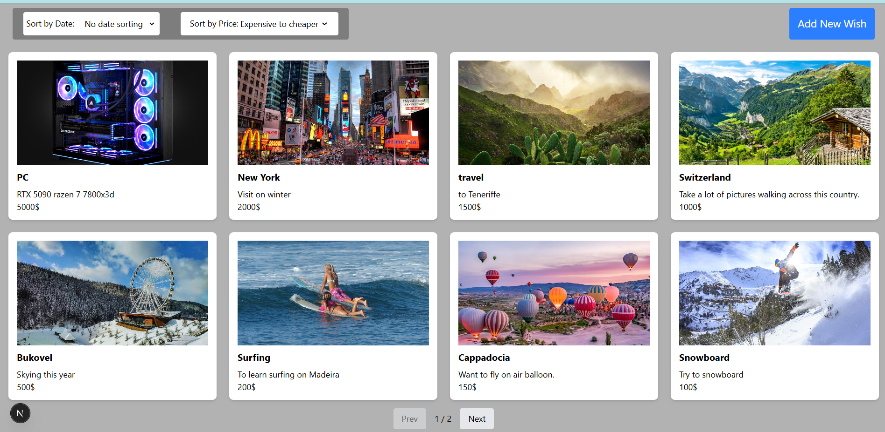
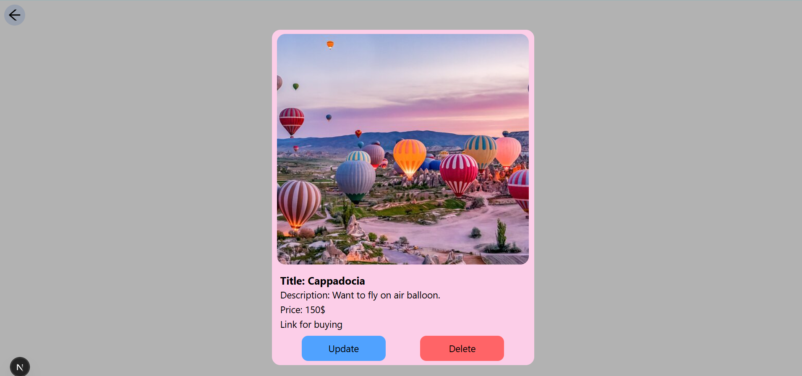

This is a [Next.js](https://nextjs.org) project bootstrapped with [`create-next-app`](https://nextjs.org/docs/app/api-reference/cli/create-next-app).
To run this project at first you need run database by command: 
npm run db

after this step run the project by command: 
npm run dev

